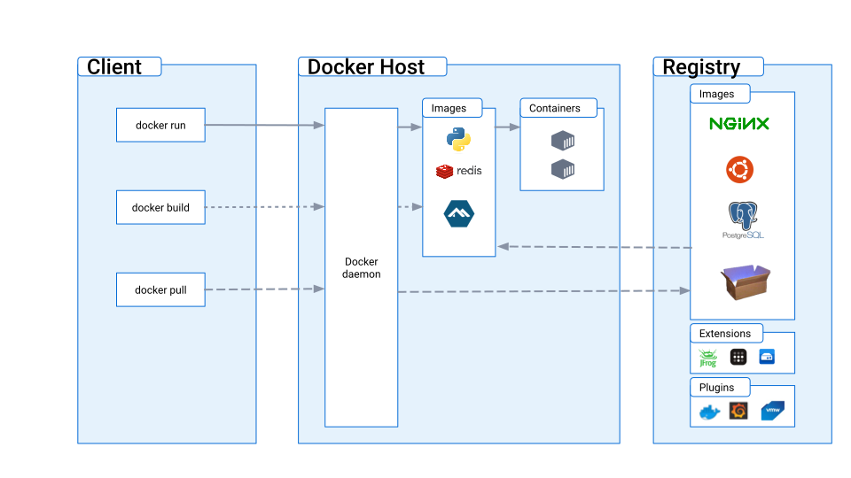
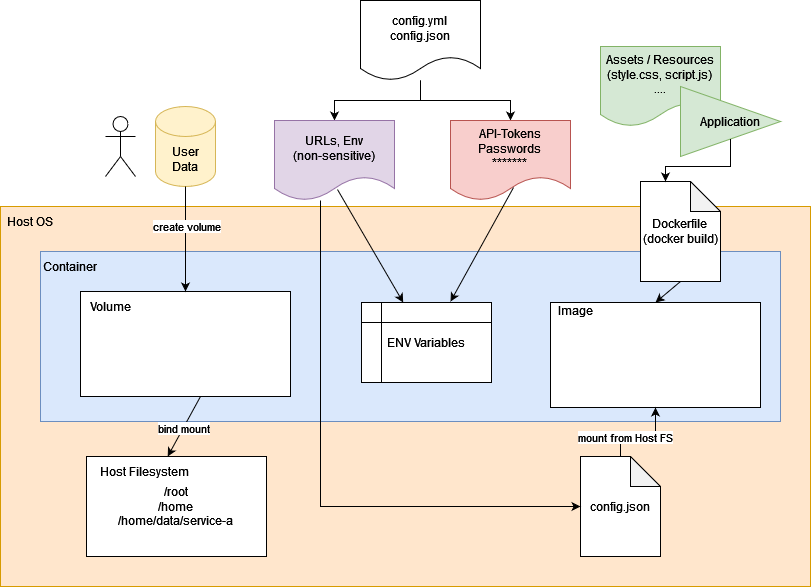

# Docker 101

---

# Agenda

- Discuss your experience (with Docker) so far
- What is Docker
- Why use Docker
- Writing Dockerfiles
- Running Containers
- **BREAK**
- Tools
- Resources
- Ways to integrate PHP with Docker
- Conclusion & Recap

---

# What is Docker?

- A toolbox (UI) for managing containers 
  - Build, Share and Run
- specifically [LXC (Linux Containers)](https://en.wikipedia.org/wiki/LXC) 

---

# Why Docker?

- Infrastructure as Code
- Immutability and reproducibility
- Simple local development setups
- When there is no other easy mechanism to install/deploy software
- Has become the de-facto standard for container based environments
  - There is also [podman](https://podman.io/)
  - Both adhere [OCI (Open Container Initiative)](https://opencontainers.org/)

---

# What is a Container?

- LXC relies on Linux Kernel [cgroups](https://en.wikipedia.org/wiki/Cgroups)
- CGroups allows applications to run in **isolation** of each other, regarding syscalls.
  - Processes (PIDs)
  - Network (Ports)
  - Filesystem (Mounts)
- Sounds familiar?
  - Virtual Machines (VM) have a similar purpose

---

 # Containers vs. Virtual Machines
 

- All containers share the same Kernel
  - ... and the same **kernel vulnerabilities**
  - VMs provide a better isolation and security layer
- Abstraction at `syscall` level vs. Hardware level (VM)
  - `syscall` is the interface between the Kernel and your applications.

---

# Key differences Containers/VMs

|                | Docker                     | VM                                   |
|----------------|----------------------------|--------------------------------------|
| Resource usage | process overhead           | full operating system                |
| Scalability    | Easy                       | Harder                               |
| Boot time      | Sub (milli-)seconds        | Minutes                              |
| Image size     | Size of application + libs | Size of application + libs + full OS |
| Isolation      | Kernel                     | Hypervisor                           |

---

# Docker concepts
- Docker Daemon: Core component, orchestrating all moving parts

---

# Docker concepts

- [Containers](https://docs.docker.com/engine/reference/run/): Isolated process with its own 
  - namespaces (network, filesystem, processes, etc.)
  - are created/instantiated out of *Images*
  - `docker run -it <image>`
- [Images](https://docs.docker.com/engine/reference/commandline/image/): Are basically a prepared "root" filesystem to "boot" a container from
  - Layered filesystem (each diff results in a new layer)
  - Images can inherit from base images (e.g. `FROM nginx`)
  - Tags: Images can be versioned using tags (e.g. `ngingx:latest`)
  - Can be `docker build -t <repo>/<image>:<tag> .` using `Dockerfile`

---

# Docker concepts

- [Registries](https://docs.docker.com/engine/reference/commandline/login/): Hold different Images
    - `docker pull <registry>/<image>:<tag>`
    - `docker push <registry>/<image>:<tag>`
- [Volumes](https://docs.docker.com/engine/reference/commandline/volume_create/): Holds data should be persisted beyond a container's lifetime.
    - Can be `mounted` into containers
    - Named: `docker volume create myvolume1`
    - Bind: `docker run -v <host-directory>:<container-directory> -it <image>`
- [Capabilities](https://docs.docker.com/engine/reference/run/#runtime-privilege-and-linux-capabilities): Permissions a container can have
   - e.g. `SYS_ADMIN`, `NET_RAW`, `SYS_BOOT`

---
# Building Images
`docker build -t ghcr.io/my-org/my-service:3.8 .`

---
# Docker Image

- Consists of stacked R/O filesystem layers
- [Dockerfile](https://docs.docker.com/engine/reference/builder/): Build instructions to construct the image
- Dive example!

---

# Dockerfile

- `FROM` defines the base image, first instruction of every `Dockerfile`
    - `FROM scratch` starts off with a completely empty image
    - `:alpine` and `:slim`
- `ADD`/`COPY` adds files to the image ([Copy vs. Add](https://www.baeldung.com/ops/docker-copy-add))
- `RUN` runs a command within the so far created image
- `ARG` build time variables
- `ENV` runtime environment variables (documentation)
- `EXPOSE` available ports that can be mapped (documentation)
- `VOLUME` defines volumes to be mounted

---

# Dockerfile
- `USER` sets the user to be used in all subsequent layers. Default `root`
  - Containers should not run as `root` unless absolutely necessary.
- `WORKDIR` default directory the container will start in
- `HEALTHCHECK` execute the command as health-check mechanism
- `CMD` defines the command to be executed when the container is started
- `ENTRYPOINT` shell script the runs before the `CMD`
  - `/entrypoint.sh` must take `$1` as `CMD` parameter

---

# Dockerfile best practices

- [Best practices](https://docs.docker.com/develop/develop-images/dockerfile_best-practices/)
- Start only one process per container
- Avoid custom `/entrypoint.sh` if not necessary
- Install only what you need during **runtime**.
  - if build- and runtime differ, use [**multi-stage**](https://docs.docker.com/build/building/multi-stage/) builds
- `RUN rm /package.deb` will not reduce the file size -> layers
- Often changed parts should be last in the `Dockerfile`
  - layers are cached and only updated if necessary
  - each changed layers updates all above layers
- Mind the build context `.dockerignore`

---

# Dockerfile security considerations

- Install only what is necessary
- Update base images before building `docker build --pull`
- [Security Best Practices](https://docs.docker.com/develop/security-best-practices/)
- `docker scout cves <image>`

- [`dive`](https://github.com/wagoodman/dive) - inspect docker layers interactively

---

# Running containers

- Starting container with default CMD
  - `docker run -it -e ENVIRONMENT=PROD -v /mnt/data:/data -p 8080:80 <image>`
- Run a command within the container (once)
  - `docker run -it -e ENVIRONMENT=PROD -v /mnt/data:/data -p 8080:80 <image> <cmd>`
- Run a command within the container (once) and delete the container afterwards
  - `docker run --rm -it -e ENVIRONMENT=PROD -v /mnt/data:/data -p 8080:80 <image> <cmd>`

---

# Running containers (2)

- Remembering and executing `docker run` with lots of parameters is cumbersome
- `docker compose` to the rescue, perfect for setting up local dev environments
  - orchestrate multiple containers in a `compose.yml` file
  - Manage in one place
    - Containers, Environment variables, Port Mappings
    - Networks
    - Volumes
- Debugging:
  - `docker exec -it <container-id> /bin/sh`
  - `docker logs -f <container-id>`

---

# Where to put what kind of data?

- Usually different categories of data considering containers
  - Configuration (environment, API endpoint URLs)
  - Secrets (API Keys, database passwords, admin passwords, SMTP)
  - Application (bundled resources, source code, binaries)
  - User data (configuration, database rows)
- Where should they be kept?
  - What should be kept in the image?
  - What should be kept in the environment?
  - What should be kept in volumes?

---

# Where to put what kind of data? (2)

---

# Tools

- [Podman](https://podman.io/) - An alternative OCI compliant Docker alternative
- [dive](https://github.com/wagoodman/dive) - Inspect docker images interactively
- [Docker Desktop](https://www.docker.com/products/docker-desktop/) - Developer UI
- [Portainer](https://www.portainer.io/) - Web interface for docker daemons
- [quay.io](https://quay.io) - Registry alternative to docker hub
- [netshoot](https://github.com/nicolaka/netshoot) - Network debugging tools in one image

---

# docker compose

- Manage multiple containers at once
- Containers are defined in `compose.yml` or `docker-compose.yml`
- Very handy for local dev environments
  - 1 container that runs your PHP Code
  - 1 container that runs a mysql database locally
- Manage containers, volumes, networks, ports, envs out of one file
- `docker compose up <service>`, `docker compose down`, `docker compose logs -f`
- `docker compose ps`, `docker compose pull`, `docker compose restart`

[Cheat sheet](https://devhints.io/docker-compose)

---

# Resources

- [Docker documentation hub](https://docs.docker.com/reference/)
- [Docker cheat-sheet](https://dockerlabs.collabnix.com/docker/cheatsheet/)
- [Dockerfile best practices](https://docs.docker.com/develop/develop-images/dockerfile_best-practices/)
- [Dockerfile reference](https://docs.docker.com/engine/reference/builder/)
- [Docker compose reference](https://docs.docker.com/compose/compose-file/)
- [Docker curriculum](https://docker-curriculum.com/)
- [Youtube tutorial](https://www.youtube.com/watch?v=3c-iBn73dDE)
- [Youtube crash course 1 hour](https://www.youtube.com/watch?v=pg19Z8LL06w)
- [The 12 factor App](https://12factor.net/)

---

# When not to use Docker?

- If you already have an easy to install software
  - e.g. `.deb`, `.rpm` packages
- If you already have single artifact that you can drop on a server
  - e.g. `.jar` files and Java already solved this problem
  - e.g. `go` binaries are statically linked and can just be run
- Automatic restart can also be solved using `systemd` units
- Adding another layer of abstraction won't make your life easier
  - You need at least a registry
  - You probably need a build pipeline
  - You need a deployment mechanism

---

# Conclusion and Recap

- What is a Container and how does it differ from VMs?
- What is a docker image and how can I build my own?
- What is a registry?
- How can I create containers?
- How can Dockerfiles be optimized and why are layers important?
- Where should persistent date be kept?
- What useful tools are there for managing docker containers?

---

# Deploying PHP applications with docker

- Multiple scenarios possible
  - `FROM php:8.2-apache`
    - considered legacy
    - weaker performance compared to `fpm`
  - `FROM php:8.2-fpm` + `nginx` in one container
    - violates the one process per container rule, but definitely simplifies setup
  - `FROM php:8.2-fpm` + `FROM:nginx` + `shared volume`
    - complex setup but gives the greatest flexbility
    - suitable for "micro service" setups
    - nginx only runs once for all services
- Using Docker container as local environment for db + app